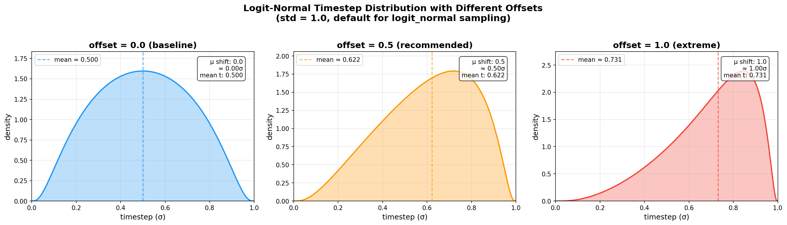

# Per-subset timestep sampling offset (`custom_attributes.timestep_sampling.offset`)

## Overview

For flow-matching models, the noise level (timestep) at which each sample is trained materially affects the final result. The `timestep_sampling.offset` custom attribute shifts the flow-matching timestep sampling distribution per dataset subset toward higher- or lower-noise regions.

It is applied as an offset to the pre-sigmoid normal sample of the logit-normal (sigmoid / shift / flux_shift) schedule. Default `0.0` (or omitted) leaves sampling unchanged.

- **Negative** value → biases toward lower-noise timesteps (detail-focused steps)
- **Positive** value → biases toward higher-noise timesteps (structure-focused steps)

## Motivation

Even at the same resolution, images with different semantic granularity benefit from a different noise emphasis:

- **Close-up / fine-detail images** (e.g. head shots, texture-heavy content): lower-noise emphasis lets the model focus on fine texture refinement.
- **Full-body / macro-structure images**: higher-noise emphasis pushes the model to learn overall structure and composition from heavier corruption.

For FLUX in particular, the model carries a strong photoreal prior. When fine-tuning on anime data, the model tends toward overly aggressive gradient updates. Applying a per-content noise offset smooths these update dynamics and stabilizes training.

## Background

This per-content noise treatment is motivated by Semantic Granularity Alignment (SGA):

> Xiong & Yuan, *"The Quadratic Geometry of Flow Matching: Semantic Granularity Alignment for Text-to-Image Synthesis"*, [arXiv:2603.10785](https://arxiv.org/abs/2603.10785)

SGA analyzes flow-matching fine-tuning as a quadratic form governed by a Neural Tangent Kernel. It shows that aligning data geometry with the optimization structure — here, offsetting the training noise per semantic granularity — mitigates gradient conflicts and improves both convergence efficiency and structural integrity.

## Usage

This feature uses `custom_attributes` to avoid expanding the subset public schema. Set it per subset in your dataset TOML config:

```toml
[[datasets.subsets]]
image_dir = "closeup_shots"
[datasets.subsets.custom_attributes]
timestep_sampling = { offset = -0.5 }

[[datasets.subsets]]
image_dir = "full_body_shots"
[datasets.subsets.custom_attributes]
timestep_sampling = { offset = 0.5 }

[[datasets.subsets]]
image_dir = "other"
# no custom_attributes needed — default is no offset
```

**Recommended range: `-0.5` to `0.5`.** Tested across multiple datasets; values in this range produce moderate, stable improvements. Larger magnitudes (e.g. `±1.0`) cause extreme distribution skew — see [Understanding the offset](#understanding-the-offset) below.

The offset is applied before the sigmoid transform, so the effect on the final sigma distribution is nonlinear and saturates at large values.

## Scope

- Applies to `sigmoid`, `shift`, and `flux_shift` timestep sampling modes.
- `uniform` and `sigma` (density-based) modes are not affected.
- Currently consumed by `anima_train_network.py` and `flux_train_network.py`. Other trainers (SD3, Lumina, etc.) do not read this attribute; setting it for those trainers is a no-op.
- The offset is applied only during **training**. Validation uses unbiased sampling for comparable loss metrics.

## Understanding the offset

### What timestep means

In diffusion and flow-matching models, timestep `t ∈ [0, 1]` represents the interpolation position between a clean image and pure noise:

- `t ≈ 0`: nearly clean image (minimal noise)
- `t ≈ 1`: nearly pure Gaussian noise (original content unrecognizable)

During training, the model receives a noised image at a randomly sampled `t` and learns the denoising direction (U-Net predicts noise ε; flow matching predicts velocity field v). **The sampling distribution of `t` determines which noise levels receive more training signal.**

### Why different timestep ranges matter

| Range | Noise level | What the model learns to restore |
|---|---|---|
| **High t** (0.7–1.0) | High | Global structure from near-pure noise — composition, spatial layout, overall tone |
| **Mid t** (0.3–0.7) | Medium | Mid-level information on top of coarse structure — proportions, lighting, regional color |
| **Low t** (0.0–0.3) | Low | Fine texture on a nearly complete image — line quality, material detail, high-frequency information |

The two major architectures have **different inherent biases** across these ranges:

- **Flow Matching** (FLUX / SD3 / Anima): continuous ODE flow modeling excels at global structure restoration in high-t ranges, but is relatively weaker at fine texture reconstruction.
- **U-Net diffusion**: multi-scale skip connections preserve spatial detail, excelling at texture restoration in low-t ranges, but with less natural strength in global structure.

The value of offset lies in **compensating for the architecture's own weakness**. FM models are naturally strong at global composition but relatively weak at fine texture restoration, so offset helps adjust the learning emphasis to provide appropriate gradient signal in the ranges where the model needs it most, adapted to the training content. U-Net architectures have the opposite bias, so similar techniques take effect in different ranges with different tuning directions. This means the same offset value produces subtly different effects on the two architectures — parameters cannot be directly transferred between them.

### How offset shifts the distribution

Default `logit_normal` sampling draws `z ~ N(0, 1)` then `t = sigmoid(z)`, producing a symmetric bell curve centered at `t = 0.5`.

Adding offset shifts the mean: `z ~ N(offset, 1)`.

- **Positive offset** (e.g. +0.5): distribution shifts toward high t, mean moves from 0.500 → ≈0.622. The model receives more gradient updates at high-noise timesteps.
- **Negative offset** (e.g. −0.5): distribution shifts toward low t, mean moves from 0.500 → ≈0.378. The model receives more gradient updates at low-noise timesteps.



### Risk of excessive offset

FM/Anima models' default timestep sampling is built on a **logit-normal Gaussian kernel** (`z ~ N(0, 1), t = sigmoid(z)`), which is already a bell-shaped distribution centered at `t = 0.5`, not uniform. Together with other bias techniques introduced during training (e.g. sigmoid scaling), **the model effectively learns denoising capability on a Gaussian kernel that already carries some bias**.

Applying offset on top of this means **stacking additional shift onto an already biased distribution**. This is why offset must be controlled carefully:

- **Distribution collapse**: at offset=1.0, the distribution becomes severely skewed and low-t ranges are rarely sampled — fine detail learning degrades severely, producing images with correct global style but blurry details and rough lines.
- **Gradient signal imbalance**: the velocity field must be accurate across the entire path `t ∈ [0, 1]`. Ranges that are barely trained will degrade at inference, potentially causing discontinuities in the inference trajectory.
- **Increased overfitting risk**: concentrating training on a narrow timestep range effectively reduces training data diversity, making overfitting in that range more likely.
- **FM amplification effect**: FM architectures have a wider expression space, making them more sensitive to timestep distribution changes than U-Net — coarse parameter tuning that merely "worked a bit worse" in the U-Net era may cause convergence failure in the FM era.

**Empirical conclusion**: ±0.5 is a stable range validated across multiple datasets. An offset of 0.5 corresponds to approximately 0.5 standard deviations of shift in logit space — enough to produce observable style guidance effects while maintaining reasonable distribution coverage without sacrificing training quality in any timestep range.
